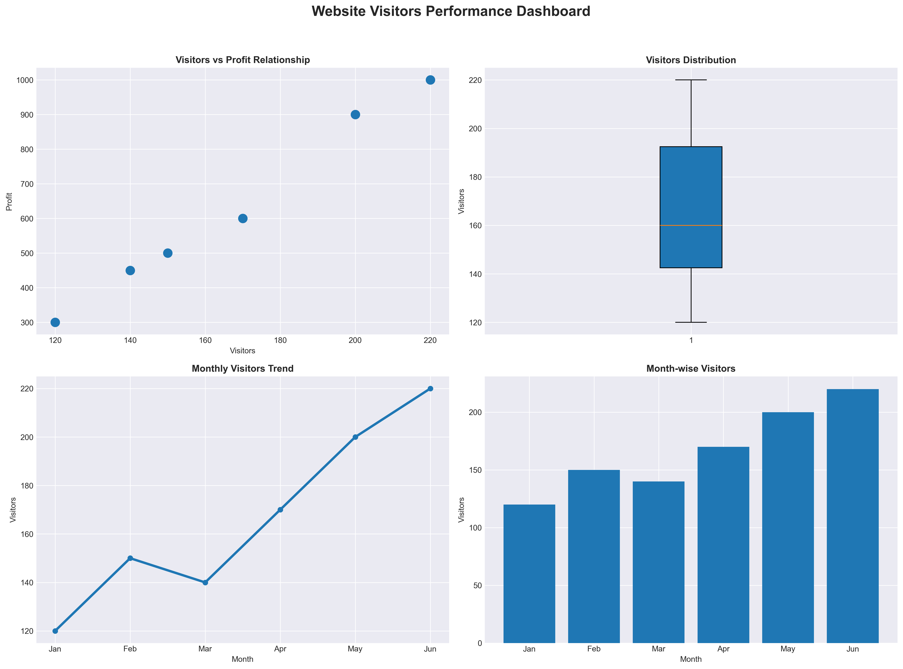

# Website Visitors Performance Dashboard

## 📌 Project Overview
This project analyzes website visitors data and presents insights using an interactive dashboard created in Python.
The dashboard helps understand visitor trends, distribution, and their relationship with profit.

## 📊 Dashboard Preview

## 🛠 Tools & Technologies Used
- Python
- Pandas
- Matplotlib
- Jupyter Notebook

## 📂 Dataset
- Sales_data.csv  
(Contains monthly visitors and profit-related data)

## 📈 Dashboard Features
- Visitors vs Profit relationship (Scatter Plot)
- Visitors distribution analysis (Box Plot)
- Monthly visitors trend (Line Chart)
- Month-wise visitors comparison (Bar Chart)

## 🎯 Key Insights
- Website visitors show a positive relationship with profit
- Visitor count increases steadily from January to June
- Highest visitors recorded in June
- Overall growth trend is positive

## ▶️ How to Run This Project
1. Open the Jupyter Notebook file
2. Make sure `Sales_data.csv` is in the same folder
3. Run all cells
4. Dashboard will be displayed

## 👩‍💻 Author
**Roshani Salekar**  
BSc IT | Data Science Student  
